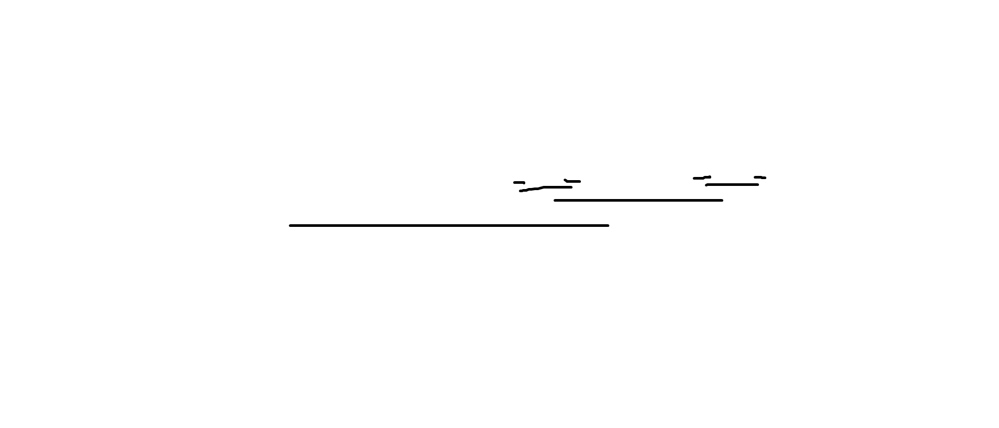
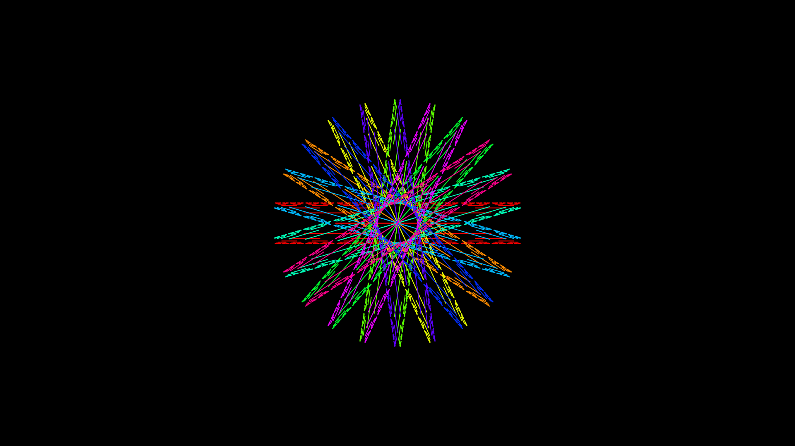
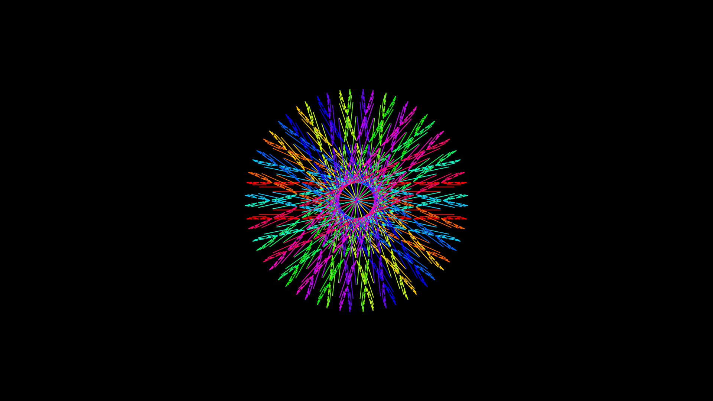
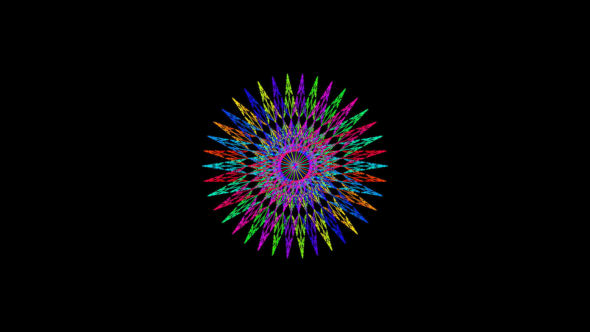
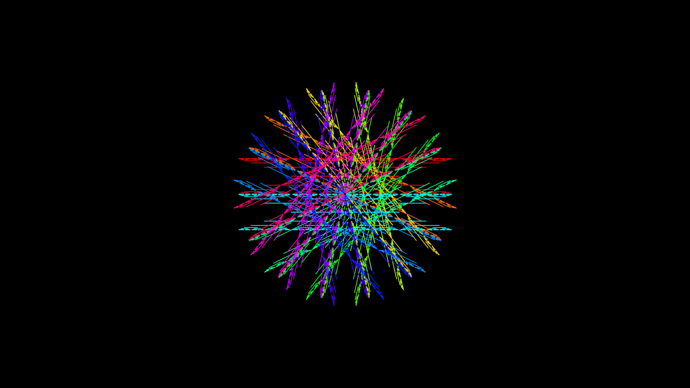
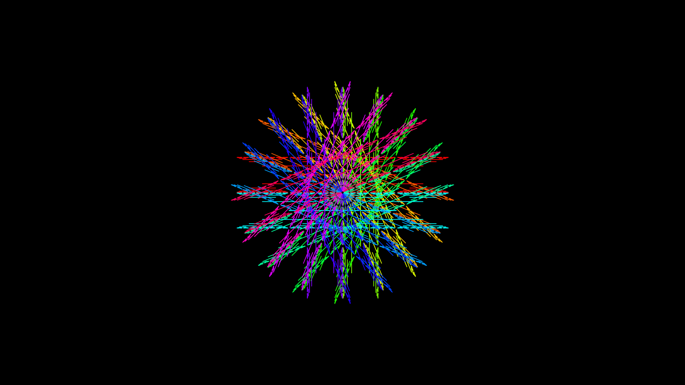

# Fractal Flake

This repository contains three different projects related to fractal snowflakes, implemented using Processing and p5.js.

## Projects Included.

### Rui_Fractal

This is a Processing project for generating fractal snowflakes.

*   **Location:** `Rui_Fractal/Rui_Fractal.pde`
*   **How to Run:** Open the `Rui_Fractal.pde` file in the Processing IDE and run the sketch.

### Rui_Fractal_SnowFlake

This is another Processing project for generating fractal snowflakes.

*   **Location:** `Rui_Fractal_SnowFlake/Rui_Fractal_SnowFlake.pde`
*   **How to Run:** Open the `Rui_Fractal_SnowFlake.pde` file in the Processing IDE and run the sketch.

### Rui_Fractal_SnowFlakeP5

This project uses p5.js to create fractal snowflakes.

*   **Location:** `Rui_Fractal_SnowFlakeP5/`
*   `index.html`: Main HTML file.
*   `sketch.js`: p5.js sketch.
*   **How to Run:** Open `index.html` in a web browser.

#### Libraries

*   `p5.js`
*   `p5.dom.js`
*   `p5.sound.js`

## Visuals

The repository includes several PNG images showcasing different fractal snowflake designs.

Initial concept

Results
Here are some examples:

## License

[Add License Information Here - e.g., MIT License]
